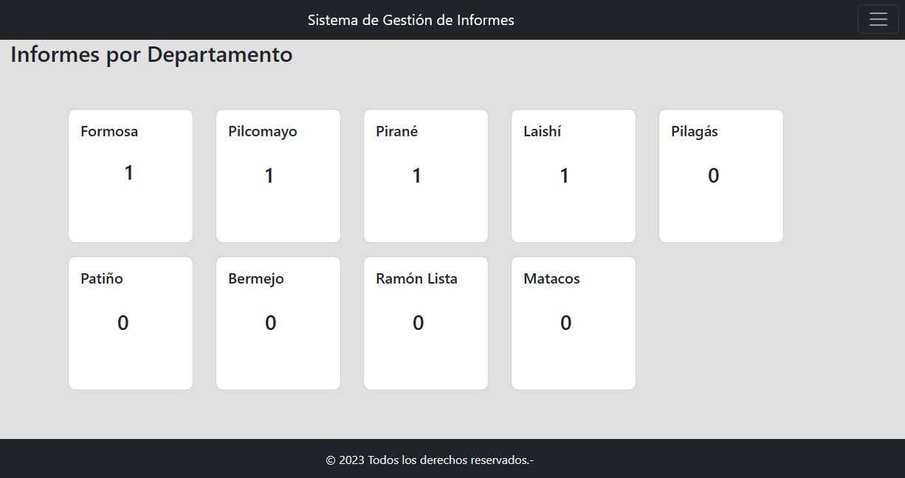
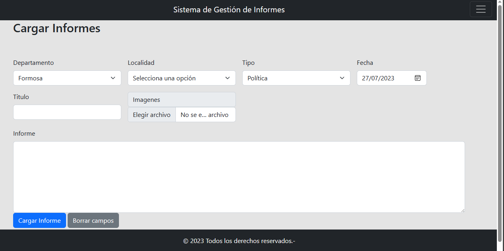

<<<<<<< HEAD
# Sistema de Gestión de Informes
=======
# Sistema de Gestión de Informes.
>>>>>>> ef05b97697d67aa6972c3108c587e2edae4ad2fd
Este es un sistema de gestión creado para realizar la creación, Edición, Visualización y Eliminación de Informes, de distintos tipos..
Este sistema consta de lo siguiente
- Login

- Index

- Carga

- Informes cargados con su respectivo filtro

- Editar

- Vista de Informes

- Usuarios

# Requerimientos:
- Para poder utilizar este sistema, se requiere tener instalado, node v18.17.0, mysql server, xamp para corroborar datos de la base de datos.
# Instalación:

1- Clonar el repositorio con el comando git clone.
2- Una vez clonado, ir a la carpeta src y abrir una terminal.
3- Escribir el comando npm install (se requiere node.js).
4- Crear el archivo .env, para configurar las variables del sistema. Ten en cuenta que lo debes completar con el archivo .envExample del repositorio.
5- Una ves realizado todos los pasos con éxito, ejecutar el comando node app y el sistema estará en marcha.
6- Para ingresar al sistema, debes escribir https://tu-ip:port-elegido/login, el usuario por defecto es admin y password 1234, lo puedes cambiar en  el apartado de usuarios.

# Tecnologias utilizadas
1- Javascript.
2- Node.js
3- Mysql.

